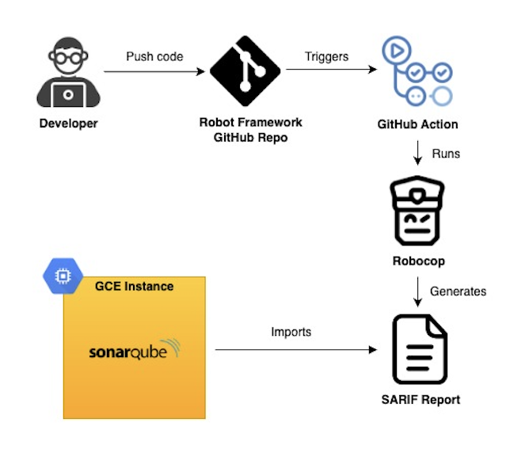

# robocop-sonarqube-integration
A demonstration of integrating Robocop static code analysis reports into SonarQube for Robot Framework projects.

## Table of Contents
- [Introduction](#introduction)
- [Tools](#tools)
- [Workflow](#workflow)
- [Installation](#installation)
- [Configuration](#configuration)

## Introduction
This repository is a demonstratation of how you can import Robocop analysis report into your SonarQube project. Robocop is a static code analysis tool for Robot Framework code. Robot Framework is a generic open-source test automation framework. SonarQube is the most popular static code analysis tool which supports 29 programming languages. However, SonarQube does not support Robot Framework language out-of-the-box. 

The repository contains a few functional tests using Robot Framework Browser library. The static code analysis of Robot Framework code is performed using Robocop which generates an analysis report. Finally, this Report is imported to SonarQube server.

## Tools
- [Robot Framework](https://robotframework.org/) [v7.0.1](https://github.com/robotframework/robotframework/releases/tag/v7.0.1)
- [Broswer Library](https://robotframework-browser.org/) [v18.8.0](https://github.com/MarketSquare/robotframework-browser/releases/tag/v18.8.0)
- [Robocop](https://robocop.readthedocs.io/en/stable/) [v5.4.0](https://github.com/MarketSquare/robotframework-robocop/releases/tag/5.4.0)
- [SonarQube](https://docs.sonarsource.com/sonarqube/latest/) v9.8 or higher

## Workflow
Whenever the developer pushes new code to the repository, GitHub Action is triggered. The workflow of GitHub Action first runs the Robocop analysis to generate an output report in SARIF format. Then, the SARIF report is imported into the SonarQube Server running on GCE Instance.


## Installation
1. Install Python 3.8 or newer, [precondition](https://robotframework.org/robotframework/latest/RobotFrameworkUserGuide.html#python-installation) for Robot Framework.
2. Install [Node.js](https://nodejs.org/en/download/package-manager), precondition for Browser Library.
3. Clone the repository:
   ```bash
   git clone https://github.com/Uqqasha/robocop-sonarqube-integration.git
4. Navigate to the project directory.
5. (Optional) Create [Python virtual environment](https://packaging.python.org/en/latest/guides/installing-using-pip-and-virtual-environments/#creating-a-virtual-environment).
    - on macOS/Linux:
        ```bash
        python3 -m venv .venv
        source .venv/bin/activate
    - on Windows:
        ```bash
        python3 -m venv .venv
        .venv\Scripts\activate
6. Install dependencies:
   ```bash
   pip install -r requirements.txt
7. [Initialize](https://robotframework-browser.org/#installation) Browser Library:
   ```bash
   rfbrowser init

### SonarQube Server
For this demonstration, the SonarQube server is hosted on a Google Cloud Compute Engine (GCE) Instance by running it as a Docker container inside the Instance. The steps provided below are specific to Google Cloud. However, SonarQube server can be hosted anywhere, either on your local machine or another cloud platform, as long as it is publicly accessible.
1. [Create a GCE Instance](https://cloud.google.com/compute/docs/instances/create-start-instance#console) with a Public IP in any available region and zone.
2. [SSH](https://cloud.google.com/compute/docs/instances/ssh) into the created Instance.
3. [Install Docker](https://docs.docker.com/engine/install/ubuntu/) in the Instance.
    - (Optional) If you want to use docker commands without sudo:
        ```bash
        sudo usermod -aG docker $USER
        newgrp docker
4. Pull the SonarQube Docker Image and run the SonarQube Container:
    ```bash
    docker run -d --name sonar -p 9000:9000 sonarqube:lts-community
    ```
    - Since we map port 9000 on the host machine to port 9000 on the container, remember to allow port 9000 on GCE Instance for inggress by [adding the Firewall Rule from Google Cloud Console](https://cloud.google.com/firewall/docs/using-firewalls).
5. Copy the Public IP Address of your GCE Instance and paste it in a web browser with port 9000 appended at the end:
    ```bash
    https://<Public-IP>:90000
    ```
6. You will see the SonarQube Server login page. The default credentials for admin are:
    ```bash
    Login: admin
    Password: admin
    ```
7. You will be prompted to update the admin credentials. After that, SonarQube dashboard will appear. 

## Configuration
### SonarQube
1. Set the following [GitHub Secrets](https://docs.github.com/en/actions/security-for-github-actions/security-guides/using-secrets-in-github-actions#creating-secrets-for-a-repository) in your repository:
    |  Name           |  Value                                                                    |
    | ---             | ---                                                                       |
    | SONAR_TOKEN     | Enter an existing token or a newly created one for your SonarQube project |
    | SONAR_HOST_URL  | The hostname of your SonarQube Server                                     |
2. The SonarQube configuration file is [sonar-project.properties](sonar-project.properties).
    - sonar.projectKey: Specifies the SonarQube project key.
    - sonar.sarifReportPaths: Specifies the SARIF report file to be imported during analysis. 

### Robocop
The configuration file for Robocop is [.robocop](.robocop). 
- --configure return_status:quality_gate:E=0:W=-1:I=-1
    - By default, the return status of Robocop command is the number of issues reported. For example, if Robocop found 2 Errors, 3 Warnings, and 3 Info issues, the return status of the command will be 8. In GitHub Actions, if the return status of a command is any value other than 0, the workflow returns with a failure at that point. To overcome this behavior, this setting is configured in Robocop. -1 means that return status is not affected by number of issues.
- --reports all,sarif
    - This option tells Robocop to generate all default reports and a SARIF report.
- --configure sarif:report_filename:robot.sarif.json
    - This option configures the name of SARIF output report.

## Usage
To run the workflow, simply push to your repository's main branch and the GitHub Action will be triggered.

### Robocop
To run Robocop analysis outside of GitHub Action workflow, simply run the following command from project's root directory:
```bash
    robocop
```
It will automatically detect all the Robot Framework files in the directory and sub-directories. Options for robocop command can be configured in the [.robocop](.robocop) file or through command-line as well.

### Robot Framework
To run Robot Framework tests:
```bash
~> robot [OPTIONS] file_name.robot

OPTIONS:
  --outputdir <dir>, --d <dir>               Defines where to create output files
  --include <tag>, -i <tag>                  Include test cases with this tag
  --exclude <tag>, -e <tag>                  Exclude test cases with this tag
  --variable <name:value>, -v <name:value>   Sets individual variables 

EXAMPLE:
robot -d .\Output\ -i login -v HEADLESS:TRUE .\Tests\saucedemo.robot
```